# seymourlib

[](https://github.com/richard-berg/seymourlib/actions/workflows/ci.yml)
[](https://codecov.io/gh/richard-berg/seymourlib)
[](https://pypi.org/project/seymourlib/)
[](LICENSE)

Python client for Seymour masking screens, connected via direct serial or Global Caché iTach IP2SL. Built for rock-solid control loops, [Home Assistant](https://www.home-assistant.io/) integrations, and quick bench testing. 😎

---

## Highlights

- Async-first client and transport abstractions (TCP/IP2SL vs native serial) with consistent APIs.
- Protocol helpers that mirror the official Seymour RS232 spec, including parsing/validation utilities.
- `seymourctl` CLI for one-off commands, scripting, and smoke tests in CI.
- Zero-config Global Caché IP2SL and serial-port discovery via async helpers and CLI subcommands.
- Movement/preset commands poll controller status and return only once the motors report HALTED/STOPPED, so scripts never race ahead.
- Batteries-included retry logic (`tenacity`), timeout handling, and graceful cancellation via `anyio`.

## Architecture at a Glance

```mermaid
flowchart TB
     App[Your automation / HA stack] -->|async API| Client[SeymourClient]
     Client --> Protocol[Protocol helpers]
     Client --> Transport
     Transport -->|TCP 4999| IP2SL[Global Caché IP2SL]
     Transport -->|RS232| Screen[Seymour Masking Screen]
     IP2SL -->|RS232| Screen
```



## Installation

### Requirements

- Python 3.11+
- `uv` >= 0.9 (preferred) or classic `pip`

### Quick install (recommended)

```bash
uv tool install --python 3.11 "seymourlib[serial]"
```

- This pulls the published wheel straight from [PyPI](https://pypi.org/project/seymourlib/) and drops a `seymourctl` executable anywhere on your `PATH`.
- Use `seymourctl --help` to confirm things are wired up, then jump straight to the CLI examples below.

### Existing virtual environments

Already have a project venv or `uv` workspace? Install directly:

```bash
uv add "seymourlib[serial]"
```

This will update your project's dependencies, install the latest source distribution of `seymourlib`, and update whatever lockfiles your project may use.

> 💡 The optional `serial` extra pulls in `pyserial-asyncio` so the same client works over USB/RS232 without the IP bridge.  If you want to trim
your project's dependency graph and **never** plan to talk over direct RS232, you can skip it.

### Classic pip fallback

```bash
python -m venv .venv
. .venv/bin/activate  # or .venv\Scripts\activate on Windows
pip install "seymourlib[serial]"
```

---

## Local Development

To debug, contribute code, or run the full test suite:

1. **Clone & bootstrap**
    - `git clone https://github.com/richard-berg/seymourlib.git`
    - `cd seymourlib`
    - `uv sync --all-extras`
2. **Sanity-test the library**
    - `uv run pytest` for local regression.
    - `SEYMOUR_HOST=<HOSTNAME> uv run seymourctl -v status` to hit your target once hardware is reachable.
3. **Wire up hardware**
    - Confirm straight-through RS232 between IP2SL and the Seymour control port.
    - For direct USB serial, a FTDI-based adapter keeps timing stable.
4. **Pick your transport**
    - `TCPTransport(host, port=4999)` for IP2SL.
    - `SerialTransport(port="COM5")` for direct connection (requires `[serial]`).

---

## Usage Examples

### Python API

```python
import asyncio
from seymourlib.client import SeymourClient
from seymourlib.transport import TCPTransport

async def main() -> None:
     async with SeymourClient(TCPTransport("192.168.1.70")) as client:
          status = await client.get_status()
          print(status)

asyncio.run(main())
```

### CLI

```bash
seymourctl --host 192.168.1.70 status
seymourctl --host 192.168.1.70 preset apply 235
seymourctl --help
```

Motion-oriented commands such as `calibrate`, `positions in/out/home`, and `preset apply` block until the controller reports `HALTED` or `STOPPED_AT_RATIO`, keeping CI and automation flows deterministic without manual `sleep` calls.

### Transport discovery (Python API)

```python
import asyncio
from seymourlib.discovery import (
    enumerate_serial_transports,
    enumerate_tcp_transports,
)


async def main() -> None:
    tcp_devices = await enumerate_tcp_transports()  # listens for Global Caché beacons
    serial_ports = await enumerate_serial_transports()
    print("TCP devices:")
    for device in tcp_devices:
        print(device.host, device.metadata.get("Model", ""))

    print("Serial ports:")
    for port in serial_ports:
        print(port.device, port.description)


asyncio.run(main())
```

`enumerate_tcp_transports()` joins the Global Caché multicast group and returns deduplicated IP2SL candidates (override `interval` to listen longer or `interface_ip` to bind a specific NIC). `enumerate_serial_transports()` surfaces every local serial adapter with the proper Seymour baud rate by default.

### Transport discovery (CLI)

```bash
seymourctl discover tcp
seymourctl discover serial
```

Use `discover tcp` when you need to confirm IP2SL devices are visible on the LAN; the table output includes the advertised model, status, and UUID from the Global Caché beacons. `discover serial` lists local USB/RS232 adapters with hardware IDs so you can select the right port before launching the client.

---

## IP2SL Setup & Diagnostics

### 1. Test direct serial first

- Connect a laptop directly to the Seymour RS232 port with a known-good USB adapter.
- Use `RealTerm`, `CoolTerm`, or any tty tool (115200 8N1 by default - verify via Seymour docs) to send a `PS?` (position status) command.
- Once commands succeed locally, you know the projector + cable + command syntax are correct before adding the network hop.

### 2. Discover the IP2SL via iHelp

- Download [Global Caché iHelp](https://www.globalcache.com/files/software/iHelp.zip) and run it on the same subnet.
- Press **Scan** to locate the IP2SL; note the MAC, firmware, and current IP.
- If nothing shows up, temporarily disable host firewalls or plug directly into a laptop + small DHCP scope.

### 3. Pin the network configuration

- Point a browser at `http://<your-ip>/` (from step 2) if you want a point-and-click GUI for DHCP/static IP, firmware, and reboot controls.
- Otherwise, install [Global Caché iTest](https://www.globalcache.com/files/software/iTest.zip).
  - Use iTest or telnet into port **4998** (the configuration/control port).
  - Send `set dhcp 0`, `set ip <static>`, `set mask <subnet>`, `set gateway <gw>`, then `save` to burn settings.
- Reboot (power cycle or `reboot` command) and confirm the device responds on the static IP.
- Document the MAC/IP in your DHCP reservations to avoid future collisions.

### 4. Lock the serial parameters

- Open the IP2SL web UI and switch to the **Serial** tab, or telnet/iTest into port **4998** for command-line configuration.
- Ensure the port is set to **115200 baud, 8 data bits, no parity, 1 stop bit** to match Seymour’s RS232 spec.
- Saving via the UI writes immediately; if you used the control port, run `set baud 115200`, `set data 8`, `set parity 0`, `set stop 1`, then `save` and reboot so the bridge always boots with the correct framing.

### 5. Exercise the serial bridge with iTest

- Open iTest (or `telnet`)
- Target port **4999** on the static IP, choose **RAW** mode, and click **Connect**.
- Send a few simple commands (e.g. `[01S]`, `[01P]`). The response should echo immediately.
- If latency creeps in, verify telnet keep-alives/device busy LEDs. Keep the window open while you walk through automation flows to watch the live traffic.

### 6. Promote to seymourlib

- Update your `.env` / config with the same host/port verified above.
- Start with `uv run seymourctl -v status` (verbose logging shows full request/response frames).
- Flip to automation ([Home Assistant](https://www.home-assistant.io/), Homebridge, etc.) once CLI calls are boringly reliable.

---

## Troubleshooting & Field Notes

- ⚡ **No response over TCP but serial works** - Ensure port 4999 is open on local firewalls and that the IP2SL LED blinks on connect; if not, recheck the static IP settings from step 3.
- 🔌 **Commands hang after a day** - The IP2SL can queue stale sockets; send `set rs232disconnect 1` over port 4998 so idle TCP clients auto-close.
- 🔁 **Race conditions from HA automations** - Wrap your automations with seymourlib's async context manager so only one command pipeline exists per transport.
- 🧪 **Need deeper diagnostics** - Add `--verbose` to `seymourctl` to dump protocol frames, or [enable debug logging](https://docs.python.org/3/library/logging.html) to capture per-request timestamps.
- 🛠️ **Firmware drift** - Global Caché publishes release notes; mismatched firmware sometimes defaults back to DHCP on reboot. Always export a config snapshot in iHelp after upgrades.

---

## Related Docs & Inspiration

- [Seymour Screen Excellence RS232 Protocol PDF](https://www.seymourscreenexcellence.com/) (request via dealer portal).
- [Global Caché Knowledge Base](https://globalcache.zendesk.com/).
- [Home Assistant Template Switch Cookbook](https://www.home-assistant.io/integrations/template/) for inspiration on wiring seymourlib into HA.
- [CoolTerm Serial Terminal](https://freeware.the-meiers.org/) - handy for the direct-serial smoke test.

---

## Contributing

- Fork, create a feature branch, and open a PR (tests + type checks 🚦 required).
- `pre-commit run` before pushing.
- Issues and hardware findings are welcome - real-world serial logs are gold for regression tests.

Need something else? Open a discussion or ping via Issues and we’ll figure it out together. 🙌
